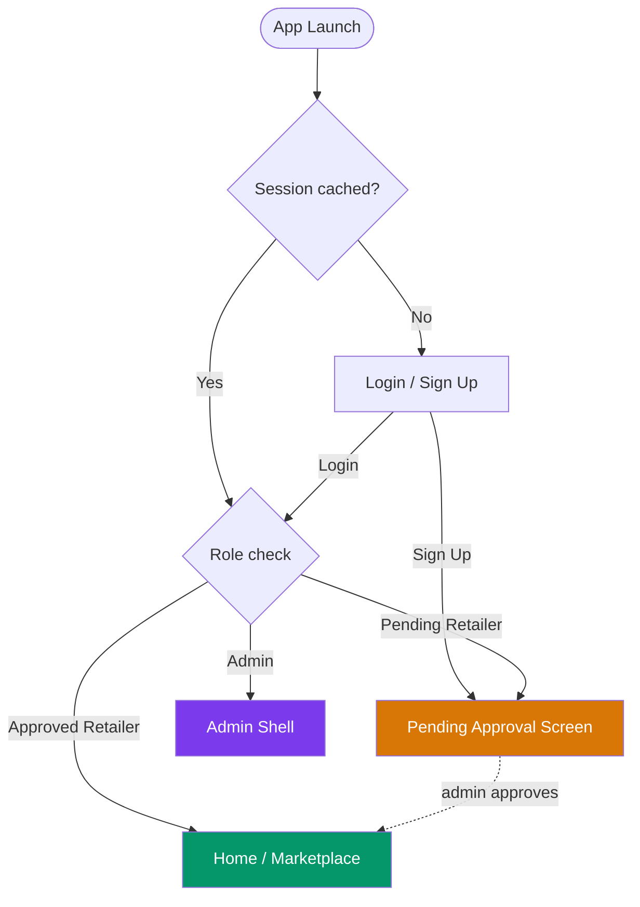
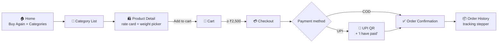
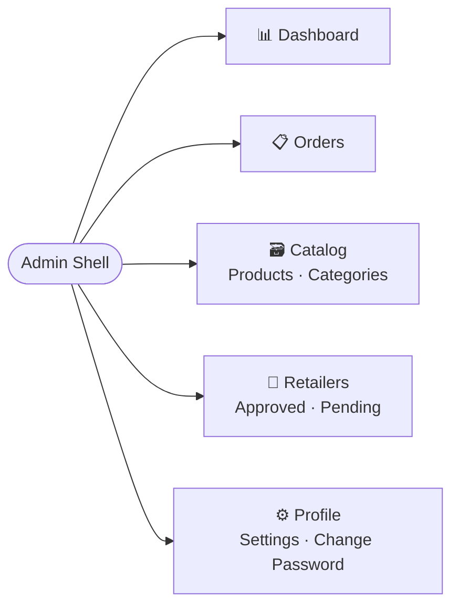
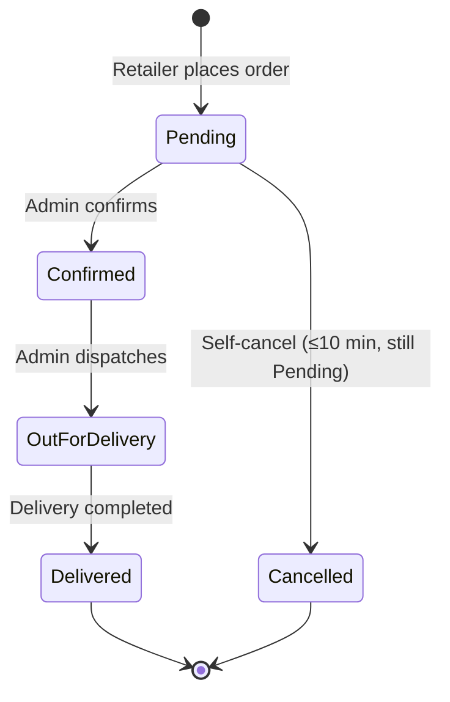
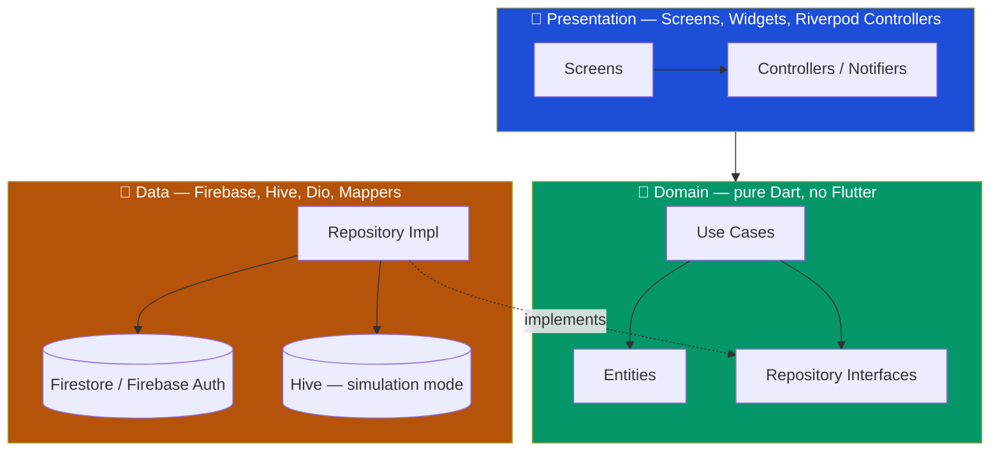
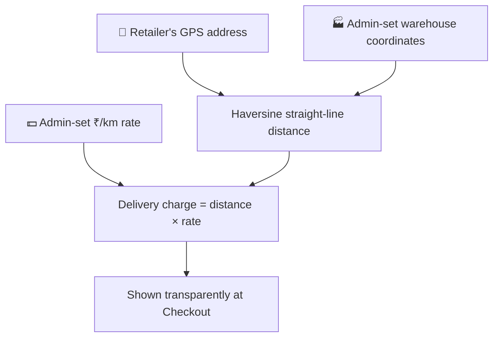

# 🛒 Jyoti Traders

**A closed, invite-only B2B wholesale ordering app** for a local Kirana (grocery/FMCG) distributor and their network of ~30 verified retailers — replacing phone-call and WhatsApp ordering with a structured, trackable digital system.

[](https://flutter.dev)
[](https://dart.dev)
[](ARCHITECTURE.md)
[](https://riverpod.dev)
[](https://firebase.google.com)
[](android/)
[](phases.md)

> 📖 Full docs: [`PRD.md`](PRD.md) (product spec) · [`ARCHITECTURE.md`](ARCHITECTURE.md) (technical design) · [`rules.md`](rules.md) (dev rules) · [`phases.md`](phases.md) (source of truth for build status)

> 🧾 **[Open the interactive project showcase →](https://claude.ai/code/artifact/b3cd527c-b352-4603-988f-7a218b3c8b99)** — live diagrams, order-tracking stepper, and slab-pricing/delivery calculators you can play with.

---

## 📚 Table of Contents

- [What is this?](#-what-is-this)
- [At a Glance](#-at-a-glance)
- [Business Rules](#-business-rules)
- [Feature Set](#-feature-set)
- [App Flow](#-app-flow)
- [Order Lifecycle](#-order-lifecycle)
- [Architecture](#-architecture)
- [Folder Structure](#-folder-structure)
- [Quantity-Based Pricing](#-quantity-based-slab-pricing)
- [Delivery Charge Calculation](#-delivery-charge-calculation)
- [Tech Stack](#-tech-stack)
- [Product Categories](#-product-categories)
- [Getting Started](#-getting-started)
- [Testing](#-testing)
- [Building a Release](#-building-a-release-apk)
- [Project Status](#-project-status)
- [Support](#-support)

---

## 🎯 What is this?

**Jyoti Traders** is *not* a public marketplace — it's a **closed system**. Every retailer signs up, then sits in a "Pending" state until the admin (the shop owner) manually approves them. Once approved, retailers browse the catalog, place bulk orders (₹2,500 minimum), pay via COD or UPI, and track delivery — all from a phone. The admin runs the whole operation — catalog, retailer approvals, order fulfillment, delivery pricing — from a persistent admin shell.

The app ships with a **Hive-backed simulation mode**: with Firebase on placeholder credentials, auth/catalog/cart/orders all run locally, so the full app is runnable and demoable with zero backend setup.

## 📊 At a Glance

| | |
|---|---|
| 🎯 **Target scale** | ~30 verified retailers, 1 admin |
| 💰 **Minimum order** | ₹2,500 |
| 📦 **Product categories** | 15 |
| 🗂️ **Dart source files** | 181 |
| 🧮 **Lines of Dart** | ~16,500 |
| ✅ **Test files** | 56 |
| 🏗️ **Architecture** | Clean Architecture, feature-first |
| 📱 **Min Android** | 7.0 (API 24) |

## 📜 Business Rules

These are hard-enforced constraints, not suggestions:

| Rule | Detail |
|---|---|
| **Minimum order** | ₹2,500/order — blocked at checkout below this with a clear message |
| **Manual approval** | New sign-ups sit `Pending` until the admin approves them |
| **Closed user base** | No public sign-up; every account is vetted |
| **Delivery charge** | Per-km, calculated from the retailer's GPS-captured address to the warehouse |
| **Payments** | Cash on Delivery, or UPI (QR-code based, no gateway) |
| **Own delivery** | The client's own delivery staff — no third-party logistics |
| **Self-cancel window** | Retailer can cancel only while `Pending`, only within 10 minutes of placing |

## ✨ Feature Set

<table>
<tr><td width="50%" valign="top">

### 👤 Retailer

- Category-wise home grid + promo banners
- "Buy Again" rail (frequently-bought, one-tap re-add) + low-stock heads-up banner
- Search, filter by price/availability
- Product detail with slab rate card & weight picker
- Cart with live total + min-order warning
- Checkout — COD / UPI, delivery charge shown up front
- Order confirmation, shareable via OS share sheet
- Order history with visual tracking stepper
- Self-cancel within the window
- Profile: shop info, address, contact

</td><td width="50%" valign="top">

### 🛠️ Admin

- Dashboard: today's orders, pending approvals, retailer count, low-stock alerts, orders/day chart
- Retailer approval queue — one-tap approve/reject
- Product CRUD — images, price, unit, stock, category, slab rate cards
- Category CRUD — icons, active toggle, drag-to-reorder
- Order management — status pipeline + CSV export of the filtered list
- Delivery settings — warehouse coordinates + per-km rate
- Retailer directory — order history & total spend per retailer
- Self-service Change Password + Settings tab

</td></tr>
</table>

## 🧭 App Flow



**Retailer shopping path** — Home → Category → Product Detail → Cart → Checkout → Confirmation → Order Tracking:



**Admin shell** (Phase 9 — persistent bottom-nav tabs, not a dashboard hub):



## 🔄 Order Lifecycle



A placed order **freezes** its line-item pricing — editing a product's rates later never re-prices a historical invoice.

## 🏗️ Architecture

Strict **Clean Architecture** — Presentation → Domain → Data. The Domain layer has zero Flutter/Firebase dependencies; everything flows through abstract Repository interfaces.



**Rules enforced project-wide** (see [`rules.md`](rules.md)):
- A Screen never imports `data/` directly — only Controllers → Use Cases → Repository interfaces.
- Every provider uses `autoDispose`.
- No `setState()` where Riverpod owns state; no business logic in `build()`.

## 📁 Folder Structure

```
lib/
├── core/            # constants, network (Dio), navigation (GoRouter), theme, services, utils
├── domain/          # entities, use cases, repository interfaces, value objects — pure Dart
├── data/            # repositories, datasources (remote: Firestore · local: Hive · seed), models
├── features/        # feature-first modules, each with controllers/ + screens/ (+ widgets/)
│   ├── auth/  admin/  home/  products/  cart/  checkout/
│   └── orders/  notifications/  profile/
└── shared/          # cross-feature providers, widgets, utils
```

## ⚖️ Quantity-Based (Slab) Pricing

Per-kg products are priced on a quantity ladder — buy more weight in one line, pay less per kilo. The **whole weight bills at the single rate its band earns** (not tax-bracket-style marginal pricing).

| Quantity bought | Default rate |
|---|---|
| Below 240 g | ₹44 / kg |
| 240 g – 999 g | ₹40 / kg |
| 1 kg – 2.4 kg | ₹39 / kg |
| Above 2.4 kg | ₹38 / kg |

- The three gram boundaries are fixed shop-wide; the four rates are set **per product** by the admin.
- Retailers pick weight via quick-pick chips (100 g/250 g/500 g/1 kg/2.5 kg/5 kg) + a ± stepper, with the active band highlighted on the rate card.
- Line totals round to whole paise; paise only display when non-zero.

## 🚚 Delivery Charge Calculation



No Google Maps API dependency — the Haversine formula avoids the API-key/billing requirement. Falls back to a flat placeholder if the retailer hasn't captured their GPS location yet.

## 🛠️ Tech Stack

| Layer | Technology |
|---|---|
| **Framework** | Flutter (Dart), Android-first |
| **State management** | Riverpod (`autoDispose` everywhere) |
| **Navigation** | GoRouter |
| **Backend** | Firebase Auth + Cloud Firestore |
| **Local storage** | Hive (session cache, simulation mode) |
| **Networking** | Dio with interceptors |
| **Push notifications** | Firebase Cloud Messaging |
| **Crash reporting** | Firebase Crashlytics |
| **Images** | `cached_network_image` + Firebase Storage |
| **Charts** | `fl_chart` |
| **QR / UPI** | `qr_flutter` (client-side, no payment gateway) |
| **Animations** | `flutter_animate`, `lottie`, `shimmer` |
| **Fonts** | Google Fonts — Poppins + Inter |

## 🗂️ Product Categories

Ayurvedic Medicine · Other Grocery · Electricals · Cosmetics & Soaps · Shampoos · Tea · Rice · Oil & Oil Seeds · Lentils & Whole Pulses · Paan Patti Sahitya · Firecrackers · Cereal Grains & Foodstuff · Suut & Hardware · Suhana · Suavda

*(Admin-managed at any time via the Catalog tab — this is the client's actual inventory taxonomy, 15 groups.)*

## 🚀 Getting Started

```bash
flutter pub get
flutter run
```

Firebase currently runs on placeholder credentials (`lib/firebase_options.dart`) — the app automatically falls back to a **Hive-backed simulation mode** for auth, catalog, cart, and orders, so it's fully runnable and testable without a configured Firebase project.

**Quick test accounts (simulation mode):**

| Role | Email | Password |
|---|---|---|
| Admin | `admin@jyoti.com` | `admin123` |
| Retailer | `retailer@jyoti.com` | `retailer123` |

## 🧪 Testing

```bash
flutter analyze
flutter test
```

## 📦 Building a Release APK

```bash
flutter build apk --release
```

Output: `build/app/outputs/flutter-apk/app-release.apk`

## 🗺️ Project Status

| Phase | Status |
|---|---|
| 1 — Foundation | ✅ Complete |
| 2 — Domain Layer & Data Models | ✅ Complete |
| 3 — Core Commerce (Retailer) | ✅ Complete |
| 4 — Admin Panel | ✅ Complete |
| 5 — Delivery, Payments & Notifications | ✅ Complete |
| 6 — Polish, Animations & UX | ✅ Complete |
| 7 — Testing & QA | ✅ Complete |
| 8 — Launch Prep & Play Store | 🔶 In progress |
| 9 — Navigation Redesign | ✅ Complete |

Plus post-launch additions: order cancellation, "Buy Again", low-stock alerts, admin CSV export, order-confirmation sharing, self-service Change Password, Crashlytics. Full detail in [`phases.md`](phases.md) — the single source of truth for "what's done" and "what's next."

## 📞 Support

📞 +91 98604 60325 · ✉️ vishvatejkatkar007@gmail.com

<!-- Maintenance check status: verified (2026-08-19) — Phase 9 complete -->
